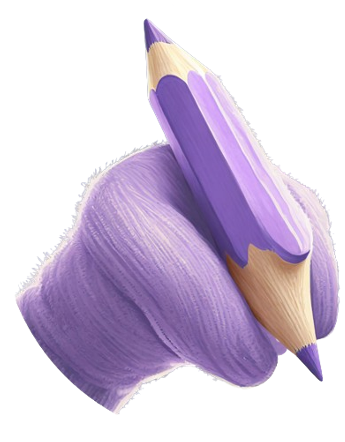
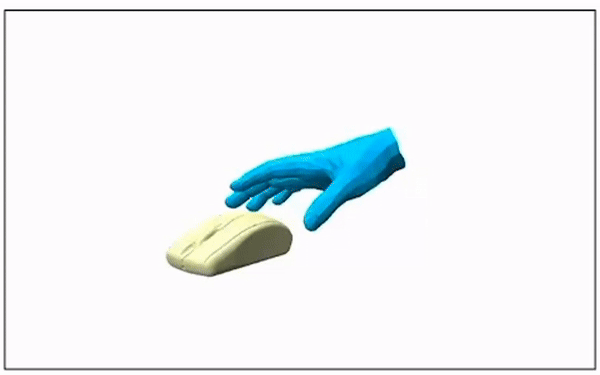
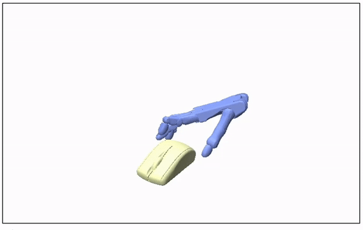
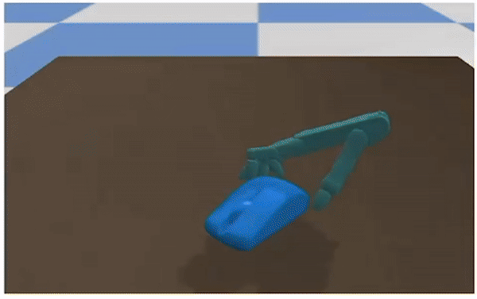

#  QuasiSim: Parameterized Quasi-Physical Simulators for Dexterous Manipulations Transfer


### [Project](https://meowuu7.github.io/QuasiSim/) | [Gradio Demo](https://huggingface.co/spaces/xymeow7/quasi-physical-sims) | [Video](https://youtu.be/Pho3KisCsu4)

The implementation of [**QuasiSim**](https://meowuu7.github.io/QuasiSim/) (ECCV'24, with all three accept initial ratings), presenting a parameterized family of quasi-physical simulators for transferring **kinematics-only human manipulation** demonstrations to **dexterous robot hand simulations**.
<!-- We tackle the optimization challenge posed by the complex dynamics inherent in dexterous manipulation by solving the control trajectory optimization problem through a physics curriculum. -->

<!-- We tackle the optimization challenge posed by the intricate dynamics involved in the dexterous manipulation via gradually solving the control trajectory optimization problem through a physics curriculum.  -->
<!-- challenge posed by the -->
<!-- The inherent difficulties of the task posed by intricate  -->
<!-- presenting a ***generalizable HOI denoising model*** designed to ***curate high-quality interaction data***. -->


https://github.com/Meowuu7/QuasiSim/assets/50799886/44233442-3382-4de8-8dbc-9e48b2b6c271

We enable accurately controlling a simulated dexterous robot hand to track complex human manipulations with **changing contact**, **non-trivial object motions**, and **intricate tool-using** in a physically realistic simulated environment. 

The repository contains 
- Analytical part of the parameterized quasi-physical simulator; 
- Detailed instructions on the optimization process for a manipulation sequence example (first two stages);
- Hybrid part with PyBullet;

We will add the remaining code and instructions, as well as the data and more manipulation examples. 
<!-- We will add the data and the evaluation process for the remaining test datasets, as well as the training procedure. These updates are expected to be completed before May 2024. -->


## Getting Started


This code was tested on `Ubuntu 20.04.5 LTS` and requires:

* Python 3.8.8
* conda3 or miniconda3
* CUDA capable GPU (one is enough)


### Environment setup

<!-- TODO: environment setup -->


<!-- (important Diffhand setup)  -->

1. Create a virtual environment and install necessary dependencies

Create a virtual environment

```shell
conda create -n quasisim python==3.8.8
conda activate quasisim
```

2. Install `torch2.2.0+cu121`
```shell
conda install pytorch==2.2.0 torchvision==0.17.0 torchaudio==2.2.0 pytorch-cuda=12.1 -c pytorch -c nvidia
```


3. Install `torch_cluster`:
```shell
mkdir whls
cd whls
wget https://data.pyg.org/whl/torch-2.2.0%2Bcu121/torch_cluster-1.6.3%2Bpt22cu121-cp38-cp38-linux_x86_64.whl
pip install torch_cluster-1.6.3+pt22cu121-cp38-cp38-linux_x86_64.whl
```

4. Install other dependences

```shell
pip install -r requirements.txt
```


5. Setup [DiffHand](https://github.com/eanswer/DiffHand):
```shell
cd DiffHand
cd core
python setup.py install
### For testing the installation ###
cd ..
cd examples
python test_redmax.py
```
<!-- It's better to install it from this project since we have made modifications to support our purpose. -->
Opting to install it from this project is preferable, as we've made modifications to align with our specific objectives.


### Get data 

**Examples data**

<!-- TODO: examples data downloading (those you put in the data folder) -->
Download the [example data](https://1drv.ms/f/s!AgSPtac7QUbHgVE5vMBOAUPzxxsV?e=B5V6mo) and organize them in the same way as we do in OnDrive. The expected file structure is as follows: 
```shell
data
 |-- grab
     |-- 102
         |-- 102_obj.npy
         |-- 102_obj.obj
         |-- 102_sv_dict.npy
         |-- 102_sv_dict_st_0_ed_108.npy
     ...
```


**Checkpoints**

<!-- TODO: checkpoints downloading -->
Download [pre-optimized checkpoints](https://1drv.ms/f/s!AgSPtac7QUbHgUNU7vF8a7V0WS9t?e=lp5GSU) and organize them in the same way as we do in OnDrive. The expected file structure is as follows: 
```shell
ckpts
 |-- grab
     |-- 102
         |-- xxx1.pt
         |-- xxx2.pt
     ...
```


**URDFs and others**

<!-- TODO: miscs data downloading -->


Download [rsc.zip](https://1drv.ms/u/s!AgSPtac7QUbHgUKUL6O4E7_0ygNT?e=PZlb0I) and [raw_data.zip](https://1drv.ms/u/s!AgSPtac7QUbHgUEIHkPdmjmHUMQc?e=Q9IYY1). Extract them in the root folder of the project. 

*Important:* Download [mano_pts.zip](https://1drv.ms/u/s!AgSPtac7QUbHgV_qhMSUm-Vmepk9?e=3ObaVb). Extract them in the folder `rsc/mano`. 


## Example Usage

<!-- In the current stage, this repo mainly contains source code on the analytical p -->
<!-- We include data, detailed instructions, and result of an example, aiming at present the inverse dynamics problem in the contact-rich manipulation scenario that we can leverage QuasiSim to solve and the optimization process. Currently we release the analytical part of QuasiSim and the first and second optimization stages. The thrid stage along with more examples will be added. 

For the example sequence `data/grab/102` showing a human hand rotating a mouse, the human manipulaton demonstration, tranferred manipulation to the simulated Shadow hand in the QuasiSim's analytical environment, and the manipulation optimized in the Bullet simulator are shown as follows.  -->

We provide the data, detailed instructions, and the results of a specific example with the aim of elucidating the inverse dynamics problem within contact-rich manipulation scenarios, which we address leveraging the physics curriculum programmed from QuasiSim. Currently, we release the analytical part of QuasiSim as well as the first two optimization stages. The thrid stage, alongside with more data and their optimization code will be added. 
<!-- we are unveiling the analytical component of QuasiSim, as well as the initial and secondary optimization stages. The third stage, along with additional examples, will be forthcoming. -->

In the case of the example sequence `data/grab/102`, which depicts a human hand rotating a mouse, the human manipulation demonstration, transferred manipulation to the simulated Shadow hand in the QuasiSim's analytical environment, and the manipulation optimized in the Bullet simulator are shown as follows. 
<!-- we present the following progression: demonstration of human manipulation, transfer of manipulation to the simulated Shadow hand within QuasiSim's analytical environment, and optimization of manipulation within the Bullet simulator. -->


|        Human Manipulation        |       Transferred to Shadow         |         Transferred to Shadow in Bullet         |
| :----------------------: | :---------------------: | :-----------------------: |
|  |  |  |

<!-- The following instructions aims at optimizing for the control trajectory that can drive  the Shadow hand to complete the tracking task (as shown in the middle demo) in the stiffest analytical environment of QuasiSim.  -->

The following instructions aim to optimize the control trajectory to enable the Shadow hand to complete the tracking task, as demonstrated in the middle demo, within the stiffest analytical environment of QuasiSim.

We save checkpoints with robot poses in the folder `checkpoints` of the experiment root folder and mesh/point cloud information in the folder `meshes`. 

### Stage 1
> **Transferring human demonstrations via point set dynamics.** In this stage, we represent the MANO model and the Shadow model within the simulation as parameterized point sets. The contact model is adjusted to its softest level. The objective is to optimize a trajectory of point sets for the Shadow hand to successfully accomplish manipulation tracking.

This stage is divided into four steps as described below.

<!-- **Experimental folder**:  -->
<!-- By defult, the experiment directory where the intermediate optimization results and checkpoints will save is `exp/`. It's better to change it to your folder for savin large files since the checkpoints will occupy a significant amount of storage. To use a different experimental folder, set the variable `local_exp_dir` in the `__init__` function of the `Runner` class in files `exp_runner_stage_1.py` and `exp_runner_stage_2.py` to your folder.  -->


By default, the experiment directory where the intermediate optimization results and checkpoints are saved is `exp/`. However, considering that the checkpoints will occupy a considerable amount of storage, it's advisable to change it to a folder designated for storing large files. To use a different experimental folder, set the variable `local_exp_dir` in the `__init__` function of the `Runner` class within the files `exp_runner_stage_1.py` and `exp_runner_stage_2.py` to your desired folder.

**Step 1: Optimizing the trajectory of the simulated dynamic MANO hand**

In this step, we optimize a control trajectory for the dynamic MANO hand model to track the reference manipulation. Please execute the following commands *sequentially*:

*Substep 1*: Optimize for a MANO dynamic trajectory to track the parametric MANO trajectory

```shell
bash scripts_new/train_grab_mano.sh # substep 1
```

For visualizing the optimized MANO hand meshes together with the object sequences, find the `retargeting_info_${epoch_idx}.npy` in the `${exp_folder}/meshes` folder saved from the last optimization loop (with the largest `epoch_idx`) and run the following command:
```shell
python visualize/vis_tracking.py --tracking_info_fn=${saved_tracking_info_fn}
```
where `saved_tracking_info_fn` should be set to the last saved optimized `retargeting_info_xxx` file. 


*Substep 2*: Identify system parameters

<!-- - To use the optimized checkpoint in the previous substep, modify arguments `ckpt_fn` and `load_optimized_init_actions` in `confs_new/dyn_grab_pointset_mano_dyn.conf` to the last one saved in the previous substep (*e.g.,* `exp/_reverse_value_totviews_tag_train_dyn_mano_acts_/checkpoints/ckpt_054060.pth`)
- Leave theses argumentes not changed to use our pre-optimized checkpoint.  -->


To utilize the optimized checkpoint from the previous substep, adjust the arguments `ckpt_fn` and `load_optimized_init_actions` in the file `confs_new/dyn_grab_pointset_mano_dyn.conf` to point to the last one saved in the previous substep (e.g., `exp/_reverse_value_totviews_tag_train_dyn_mano_acts_/checkpoints/ckpt_054060.pth`). Alternatively, leave these arguments unchanged to utilize our pre-optimized checkpoint.

Run
```shell
bash scripts_new/train_grab_mano_wreact.sh # substep 2
```

For visualizing the optimized MANO hand meshes together with the object sequences, find the `hand_obj_verts_faces_sv_dict_${epoch_idx}.npy` in the `${exp_folder}/meshes` folder saved from the last optimization loop (with the largest `epoch_idx`) and run the following command:
```shell
python visualize/vis_tracking.py --tracking_info_fn=${saved_tracking_info_fn}
```
where `saved_tracking_info_fn` should be set to the last saved optimized `hand_obj_verts_faces_sv_dict_xxx` file. 


*Substep 3*: Optimize for a MANO dynamic trajectory to physically track the demonstration

<!-- - To use the optimized checkpoint in the previous substep, modify arguments `ckpt_fn` and `load_optimized_init_actions` in `confs_new/dyn_grab_pointset_mano_dyn_optacts.conf` to the last one saved in the previous substep.
- Leave theses argumentes not changed to use our pre-optimized checkpoint.  -->


To utilize the optimized checkpoint from the preceding substep, adjust the arguments `ckpt_fn` and `load_optimized_init_actions` in the file `confs_new/dyn_grab_pointset_mano_dyn_optacts.conf` to correspond to the latest one saved in the preceding substep. Alternatively, retain these arguments unchanged to utilize our pre-optimized checkpoint.

Run
```shell
bash scripts_new/train_grab_mano_wreact_optacts.sh # substep 3
```

For visualizing the optimized MANO hand meshes together with the object sequences, find the `hand_obj_verts_faces_sv_dict_${epoch_idx}.npy` in the `${exp_folder}/meshes` folder saved from the last optimization loop (with the largest `epoch_idx`) and run the following command:
```shell
python visualize/vis_tracking.py --tracking_info_fn=${saved_tracking_info_fn}
```
where `saved_tracking_info_fn` should be set to the last saved optimized `hand_obj_verts_faces_sv_dict_xxx` file. 


The time consumption for each substep is listed below, as we tested:
| Time | `train_grab_mano` | `train_grab_mano_wreact` | `train_grab_mano_wreact_optacts` |
| ---- | ----------------- | ------------------------ | -------------------------------- |
| 3090-24G | ~3 hrs              |   ~3 hrs                   |          ~3 hrs                        |
| A800-80G | ~2 hrs 20 mins              |   ~3 hrs                   |          ~2 hrs 40 mins                        |


**Step 2: Optimizing the control trajectory for the point set constructed from the MANO hand** 

Execute the following four substeps. Please note that they cannot be excuted in parallel.
<!-- four commands sequentially for this step: -->


*Substep 1*: Kinematic MANO's point set trajectory optimization

To utilize the optimized checkpoint from the preceding substep, adjust the argument `load_optimized_init_actions` in the file `confs_new/dyn_grab_pointset_points_dyn_s1.conf` to correspond to the latest one saved in the preceding step. Alternatively, retain these arguments unchanged to utilize our pre-optimized checkpoint.

Run
```shell
bash scripts_new/train_grab_pointset_points_dyn_s1.sh # substep 1 
```


*Substep 2*: Dynamic MANO's point set trajectory optimization

To utilize the optimized checkpoint from the preceding substep, adjust the argument `load_optimized_init_actions` in the file `confs_new/dyn_grab_pointset_points_dyn_s2.conf` to correspond to the latest one saved in the preceding step. Alternatively, retain these arguments unchanged to utilize our pre-optimized checkpoint.

Run
```shell
bash scripts_new/train_grab_pointset_points_dyn_s2.sh # substep 2
```


*Substep 3*: Identify the undefined parameters


To utilize the optimized checkpoint from the preceding substep, adjust the argument `load_optimized_init_actions` in the file `confs_new/dyn_grab_pointset_points_dyn_s3.conf` to correspond to the latest one saved in the preceding step. Alternatively, retain these arguments unchanged to utilize our pre-optimized checkpoint.

Run
```shell
bash scripts_new/train_grab_pointset_points_dyn_s3.sh # substep 3
```


*Substep 4*: Dynamic MANO's point set trajectory optimization


To utilize the optimized checkpoint from the preceding substep, adjust the arguments  `ckpt_fn` and `load_optimized_init_actions` in the file `confs_new/dyn_grab_pointset_points_dyn_s4.conf` to correspond to the latest one saved in the preceding step. Alternatively, retain these arguments unchanged to utilize our pre-optimized checkpoint.

Run
```shell
bash scripts_new/train_grab_pointset_points_dyn_s4.sh # substep 4
```


In each substep, for visualizing the optimized MANO point set together with the object sequences, find the `hand_obj_verts_faces_sv_dict_${epoch_idx}.npy` in the `${exp_folder}/meshes` folder saved from the last optimization loop (with the largest `epoch_idx`) and run the following command:
```shell
python visualize/vis_tracking.py --tracking_info_fn=${saved_tracking_info_fn}
```
where `saved_tracking_info_fn` should be set to the last saved optimized `hand_obj_verts_faces_sv_dict_xxx` file. 


The time consumption for each substep is listed below, as we tested:
| Time | `s1` | `s2` | `s3` | `s4` |
| ---- | ----------------- | ------------------------ | -------------------------------- | -------------------------------- |
| A800-80G | ~2 hrs 20 mins              |   ~2 hrs                   |          ~3 hrs 15 mins                        |  ~3 hrs 30 mins                        |


As for the way of creating the point set representation from an articulated rigid mesh, we sample `nn_expand_pts` uniformly randomly from a ball with the radius controlled by `expand_factor` constructed around each surface point. The point set is then formed by concatenating all such points together. By default, `nn_expand_pts` is set to `10`, while `expand_factor` is `0.1`. Increasing the two parameters will result in a larger point set. Try to adjust them through `.conf` file. We've tested `nn_expand_pts=10;expand_factor=0.1`, `nn_expand_pts=20;expand_factor=0.2`, `nn_expand_pts=40;expand_factor=0.4`, and `nn_expand_pts=80;expand_factor=0.4`. More analysis on them will be added. 


<!-- ```shell
bash scripts_new/train_grab_pointset_points_dyn_s1.sh
bash scripts_new/train_grab_pointset_points_dyn_s2.sh
bash scripts_new/train_grab_pointset_points_dyn_s3.sh
bash scripts_new/train_grab_pointset_points_dyn_s4.sh
``` -->

**Step 3: Optimizing the trajectory of the kinematic Shadow hand**

<!-- In this step, we optimize for a kinematic Shadow hand trajectory based on the keypoint based correspondences and mesh surface point based correspondences. Execute the following command for this step:  -->

In this step, we optimize the trajectory of the kinematic Shadow hand based on keypoint-based correspondences and mesh surface point-based correspondences. Execute the following command for this step:

```shell
bash scripts_new/train_grab_sparse_retar.sh
```

The time consumption for this step is about 7 hrs as we tested on a single A800 gpu. 


For visualizing the optimized Shadow hand mesh together with the object sequences, find the `${epoch_idx}.npy` in the `${exp_folder}/meshes` folder saved from the last optimization loop (with the largest `epoch_idx`) and run the following command:
```shell
python visualize/vis_tracking.py --tracking_info_fn=${saved_tracking_info_fn}
```
where `saved_tracking_info_fn` should be set to the last saved optimized `${epoch_idx}.npy` file. 


**Step 4: Optimizing the control trajectory for the point set constructed from the simulated Shadow hand** 

Please execute the following four substeps for this step:

<!-- Execute the following the following four substeps. Please note that they cannot be excuted in parallel. -->
*Substep 1*: Track MANO's point set via the Shadow hand

To utilize the optimized checkpoint from the preceding substep, adjust the arguments in the file `confs_new/dyn_grab_pointset_points_dyn_retar.conf` as follows: 
- set `ckpt_fn` and `load_optimized_init_actions` to the path of the last saved model in **Step 2**;
- set `load_optimized_init_transformations` to the path of the last optimized model in **Step 3**. 
Alternatively, retain these arguments unchanged to utilize our pre-optimized checkpoint.


Run 
```Shell
bash scripts_new/train_grab_pointset_points_dyn_retar.sh
```

*Substep 2*: Track MANO's point set via the Shadow's point set

To utilize the optimized checkpoint from the preceding substep, adjust the arguments in the file `confs_new/dyn_grab_pointset_points_dyn_retar_pts.conf` as follows: 
- set `ckpt_fn` and `load_optimized_init_actions` to the path of the last saved model in **Step 2**;
- set `dyn_grab_pointset_points_dyn_retar_pts` to the path of the last optimized model in  the previous substep.
Alternatively, retain these arguments unchanged to utilize our pre-optimized checkpoint.


Run 
```Shell
bash scripts_new/train_grab_pointset_points_dyn_retar_pts.sh
```

*Substep 3*: System parameters identification

To utilize the optimized checkpoint from the preceding substep, adjust the arguments in the file `confs_new/dyn_grab_pointset_points_dyn_retar_pts.conf` as follows: 
- set `ckpt_fn` and `load_optimized_init_actions` to the path of the last saved model in **Step 2**;
- set `dyn_grab_pointset_points_dyn_retar_pts` to the path of the last optimized model in  the previous substep.
Alternatively, retain these arguments unchanged to utilize our pre-optimized checkpoint.

Run 
```shell
bash scripts_new/train_grab_pointset_points_dyn_retar_pts_opts.sh
```
<!-- 
```shell
bash scripts_new/train_grab_pointset_points_dyn_retar.sh
bash scripts_new/train_grab_pointset_points_dyn_retar_pts.sh
bash scripts_new/train_grab_pointset_points_dyn_retar_pts_opts.sh
``` -->


In each substep, for visualizing the optimized Shadow point set together with the object sequences, find the `hand_obj_verts_faces_sv_dict_${epoch_idx}.npy` in the `${exp_folder}/meshes` folder saved from the last optimization loop (with the largest `epoch_idx`) and run the following command:
```shell
python visualize/vis_tracking.py --tracking_info_fn=${saved_tracking_info_fn}
```
where `saved_tracking_info_fn` should be set to the last saved optimized `hand_obj_verts_faces_sv_dict_xxx` file. 

 

The time consumption for each substep is listed below, as we tested:
| Time | `retar` | `retar_pts` | `retar_pts_opts` | 
| ---- | ----------------- | ------------------------ | -------------------------------- | 
| A800-80G | ~52 mins              |   ~2 hrs                   |          ~2 hrs 20 mins                        |  


<!-- Please note that the point set constructed from the simulated Shadow hand contains 100k+ points, running the last two commands requires GPU memory of at least 56GB. Therefore, in our experiments, this part is conducted on 80GB A800 gpus. 


Optimizing the trajectory of the articulated Shadow hand directly is an alternative strategy. Adopting this option requires smaller GPU memory size. A single 3090/4090 with 24GB is enough. Please execute the following commands for this suit of optimization: -->

Please note that the point set constructed from the simulated Shadow hand contains over 100,000 points. Running the last two substeps necessitates a GPU memory of at least 56GB. Consequently, in our experiments, this part is conducted using 80GB A800 GPUs.

An alternative approach is optimizing the trajectory of the articulated Shadow hand directly. 
<!-- Optimizing the trajectory of the articulated Shadow hand directly presents an alternative approach. -->
This option requires a smaller GPU memory size. A single 3090/4090 with 24GB is sufficient. 
<!-- For the example included in the repo currently with bulky object shape and relatively clean human motion references, this strategy can achieve compatiable optimization results as the original one. However it may lead to a degeneration in some cases.  -->
For the example currently included in the repository with bulky object shapes and relatively clean human motion references, this strategy can yield compatible optimization results compared to the original approach. However, it may lead to degradation in some cases.
Please execute the following commands for this optimization suite:

```shell
bash scripts_new/train_grab_pointset_points_dyn_retar.sh
bash scripts_new/train_grab_pointset_points_dyn_retar_opts.sh
```


### Stage 2
> **Tracking via a contact curriculum.**  In this stage, we optimize the control trajectory of the simulated Shadow hand to complete the tracking task through a curriculum of contact models. Initially, the contact model is tuned to the softest level. Subsequently, we gradually adjust parameters to tune it to the stiffest level.

Run the following command: 
```shell
bash scripts_new/train_grab_stage_2_dm_curriculum.sh
```

In each stage, for visualizing the optimized Shadow hand meshe and the object sequences, find the `hand_obj_verts_faces_sv_dict_${epoch_idx}.npy` in the `${exp_folder}/${curriculum_stage_name}/meshes` folder saved from the last optimization loop (with the largest `epoch_idx`) and run the following command:
```shell
python visualize/vis_tracking.py --tracking_info_fn=${saved_tracking_info_fn}
```
where `saved_tracking_info_fn` should be set to the last saved optimized `hand_obj_verts_faces_sv_dict_xxx` file. 

### Stage 3
> **Tracking via iterative hybrid sim model training and trajectory optimization** 
 <!-- In this stage, we optimize the control trajectory of the simulated Shadow hand to complete the tracking task through a curriculum of contact models. Initially, the contact model is tuned to the softest level. Subsequently, we gradually adjust parameters to tune it to the stiffest level. -->

Run the following command: 
```shell
bash scripts_new/run_train_policy_hoi_wana.sh
```
<!-- 
In each stage, for visualizing the optimized Shadow hand meshe and the object sequences, find the `hand_obj_verts_faces_sv_dict_${epoch_idx}.npy` in the `${exp_folder}/${curriculum_stage_name}/meshes` folder saved from the last optimization loop (with the largest `epoch_idx`) and run the following command:
```shell
python visualize/vis_tracking.py --tracking_info_fn=${saved_tracking_info_fn}
```
where `saved_tracking_info_fn` should be set to the last saved optimized `hand_obj_verts_faces_sv_dict_xxx` file.  -->


<!-- ### Stage 3 -->


## TODOs

- [x] Analytical part of QuasiSim
- [x] Optimization example
- [x] Hybrid part of QuasiSim with PyBullet
- [ ] More examples
<!-- - [ ] Full version of QuasiSim -->
- [ ] Custimizing your optimization


## Contact

Please contact xymeow7@gmail.com or raise a github issue if you have any questions.


## Bibtex
If you find this code useful in your research, please cite:

```bibtex
@article{liu2024quasisim,
  title={QuasiSim: Parameterized Quasi-Physical Simulators for Dexterous Manipulations Transfer},
  author={Liu, Xueyi and Lyu, Kangbo and Zhang, Jieqiong and Du, Tao and Yi, Li},
  journal={arXiv preprint arXiv:2404.07988},
  year={2024}
}
```


## Acknowledgments

This code is standing on the shoulders of giants. We want to thank the following contributors
that our code is based on: [DiffHand](https://github.com/eanswer/DiffHand), [NeuS](https://github.com/Totoro97/NeuS) and [ControlVAE](https://github.com/heyuanYao-pku/Control-VAE). 

## License
This code is distributed under an [MIT LICENSE](LICENSE).

